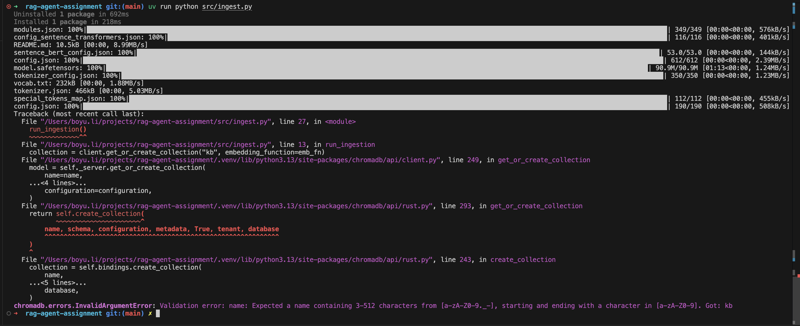
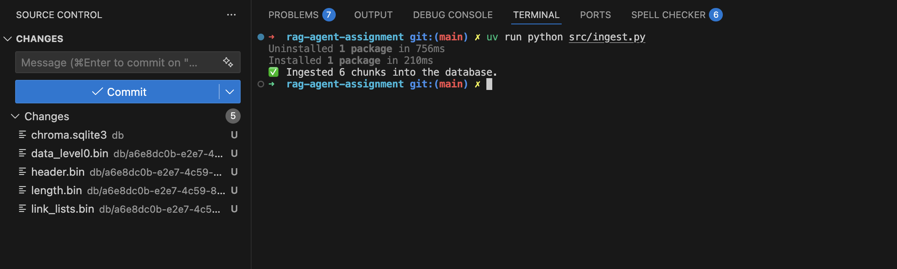
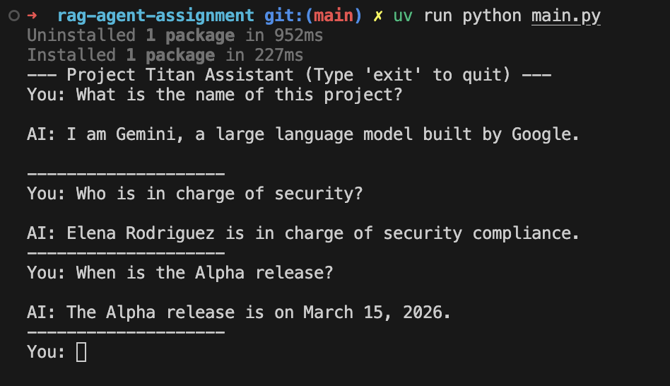
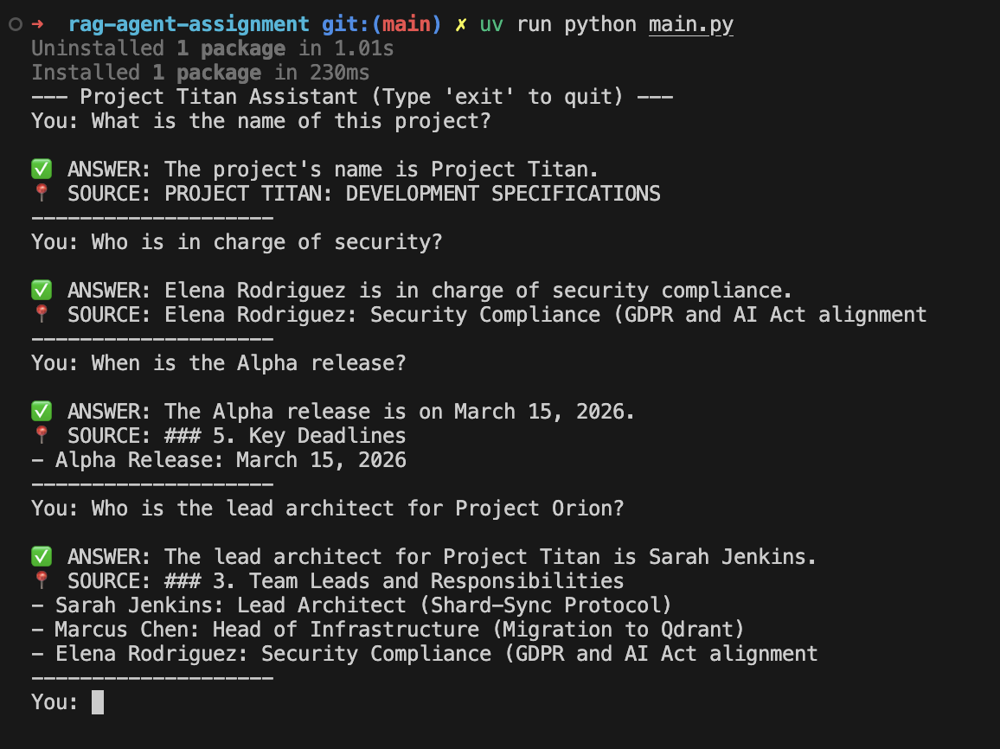
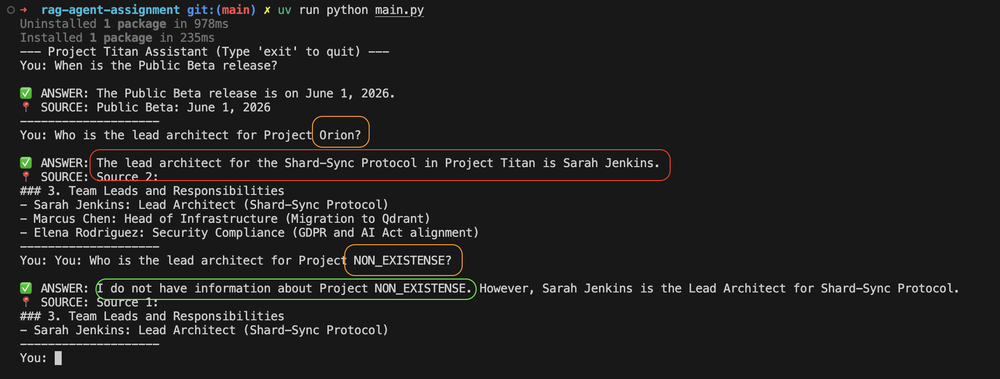

## Journal

a. **Init project**, this creates `pyproject.toml` and `.python-version`

```shell
uv init
```

b. **Add dependencies**

```shell
uv add pydantic-ai google-genai chromadb sentence-transformers python-dotenv
```

c. **Setup project structure**

```plaintext
rag-agent-assignment/
├── .env                # My API keys (Don't commit this!)
├── data/               # My local .txt or .md files
├── db/                 # Where ChromaDB will store its vectors
├── src/
│   ├── agent.py        # The Pydantic AI agent logic
│   └── ingest.py       # Script to load data into the Vector DB
├── main.py             # Entry point to run the agent
└── pyproject.toml      # Project metadata & dependencies
```

+ Configure VS Code python settings: `"python.terminal.useEnvFile": true`
+ Add `.env` to `.gitignore`

d. **Add knowledge**: `data/knowledge.txt`

e. **The ingest script** (`src/ingest.py`)

```python
import chromadb
from chromadb.utils import embedding_functions


def run_ingestion():
    client = chromadb.PersistentClient(path="./db")  # Save data to disk

    # Use a local embedding model (Requirement of your assignment)
    emb_fn = embedding_functions.SentenceTransformerEmbeddingFunction(
        model_name="all-MiniLM-L6-v2"
    )

    collection = client.get_or_create_collection("kb", embedding_function=emb_fn)

    # Example: Load your local file
    with open("data/knowledge.txt", "r") as f:
        text = f.read()

    # Simple chunking by paragraph
    chunks = [c for c in text.split("\n\n") if c.strip()]

    collection.add(documents=chunks, ids=[f"id_{i}" for i in range(len(chunks))])
    print(f"✅ Ingested {len(chunks)} chunks into the database.")


if __name__ == "__main__":
    run_ingestion()

```

f. **The agent script** (`src/agent.py`)

```python
import os
from dotenv import load_dotenv
from pydantic_ai import Agent, RunContext
import chromadb
from chromadb.utils import embedding_functions

load_dotenv()

# Setup the DB connection for the tool
client = chromadb.PersistentClient(path="./db")
emb_fn = embedding_functions.SentenceTransformerEmbeddingFunction(
    model_name="all-MiniLM-L6-v2"
)
collection = client.get_collection("kb", embedding_function=emb_fn)

# The Agent definition
agent = Agent(
    "google-gla:gemini-2.0-flash",
    system_prompt="You are a helpful assistant. Use 'search_kb' to find facts before answering.",
)


@agent.tool
def search_kb(ctx: RunContext[None], query: str) -> str:
    """Search the knowledge base for relevant facts."""
    results = collection.query(query_texts=[query], n_results=2)
    return "\n".join(results["documents"][0])

```

g. Ingest the data

```shell
uv run python src/ingest.py
```

I ran into `chromadb.errors.InvalidArgumentError`.


h. fix the `InvalidArgumentError`, it turns out the "kb" name is too short (2-char), there should be at least 3 chars. So rename it from "kb" to "knowledge_base"

```python
# ingest.py
collection = client.get_or_create_collection("knowledge_base", embedding_function=emb_fn)
# agent.py
collection = client.get_collection("knowledge_base", embedding_function=emb_fn)
```

i. delete the `data/chroma/sqlite3`, and re-run `uv run python src/ingest.py`


j. `main.py` to interact with the agent

```python
from dotenv import load_dotenv
from src.agent import agent  # This imports the 'agent' VARIABLE from the file

load_dotenv()


def chat():
    print("--- Project Titan Assistant (Type 'exit' to quit) ---")
    while True:
        user_input = input("You: ")
        if user_input.lower() in ["exit", "quit"]:
            break

        # run_sync is perfect for a simple CLI loop
        result = agent.run_sync(user_input)

        print(f"\nAI: {result.output}")
        print("-" * 20)


if __name__ == "__main__":
    chat()

```

Now, it gives me the right answers.



Yet I noticed:

1. If I asked "What is the name of this project?", I am expecting "Titan" rather than "I am Gemini, a large language model ..."
2. there is a noticeable time window between when I execute this command and when I can actually type in my question.

k. Adding structured output

```python
class AgentResponse(BaseModel):
    answer: str = Field(description="The final answer to the user's question.")
    source_snippet: str = Field(
        description="The specific text used from the knowledge_base to answer."
    )

# use AgentResponse

agent = Agent(
    "google-gla:gemini-2.0-flash",
    output_type=AgentResponse,  # Tell the agent to use the model above
    system_prompt=(
        "You are a helpful assistant. Use 'search_kb' to find facts before answering.",
        "You must provide the answer and the exact snippet of text you used.",
    ),
)

# provide source

@agent.tool
def search_kb(ctx: RunContext[None], query: str) -> str:
    """Search the knowledge base for relevant facts."""
    results = collection.query(query_texts=[query], n_results=2)

    # Check if we actually found anything
    if not results["documents"] or not results["documents"][0]:
        return "No relevant information found in the knowledge base."

    # Joining with clear separators helps the LLM distinguish between chunks
    formatted_results = []
    for i, doc in enumerate(results["documents"][0]):
        formatted_results.append(f"Source {i + 1}:\n{doc}")

    return "\n\n---\n\n".join(formatted_results)

```

Now, even better, I get the source for me to verify.


Yet I noticed:

1. Now it can answer the "What is the name of this project?" question, I suspect that the fact that I've improved the system prompt made the agent answer correctly.
2. "Who is the lead architect for Project Orion?" should give me "No relevant information found in the knowledge base." Yet it gives me a wrong answer.

l. fix the wrong answer

+ The Strategy: Reflection

```python
agent = Agent(
    "google-gla:gemini-2.0-flash",
    output_type=AgentResponse,
    # 1. Stricter prompt
    system_prompt=(
        "You are a helpful assistant. Use 'search_kb' to find facts before answering.",
        "Rules:\n"
        "1. ONLY answer using facts from 'search_kb'.\n"
        "2. If 'search_kb' returns 'No relevant information', state that you do not know.\n"
        "3. NEVER use your own training data to invent project details.",
    ),
    retries=3,  # 2. Allow the agent to try again if it fails validation
)

# 3. The Result Validator (The Hallucination Guard)
@agent.output_validator
def validate_result(ctx: RunContext[None], output: AgentResponse) -> AgentResponse:
    """Checks if the AI's answer is actually supported by the source snippet."""
    # If the AI says it found something, but the source says "No relevant information"
    if "no relevant information" in output.source_snippet.lower():
        if (
            "not found" not in output.answer.lower()
            and "don't know" not in output.answer.lower()
        ):
            # This triggers a retry loop: the AI sees this message and corrects itself
            raise ModelRetry(
                "You provided an answer but the source snippet says no info was found. "
                "Please correct your answer to say you do not know."
            )
    return output
```

The result is better.
On the one hand, it still has hallucination (the second question),
however, on the other hand the validator is actually doing some work (the third question).


---
Further Actions

+ [ ] understand why there is a noticeable time window between when I execute this command and when I can actually type in my question.
+ [ ] further reducing the hallucination
+ [ ] test on larger-scale knowledge base
